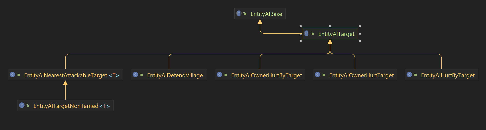

有关AI方面的讲解可以参考B站视频:https://www.bilibili.com/video/BV1Yv411K7D6/

## 绑定AI
AI的绑定过程较为简单, 只需要设定优先度和AI种类即可.
```java
@Override  
protected void initEntityAI() {  
    this.tasks.addTask(0, new EntityAISwimming(this));  
    this.tasks.addTask(1, new EntityAIAttackMelee(this, 1.0, false));  
    this.tasks.addTask(2, new EntityAIWanderAvoidWater(this, 0.8));  
    this.tasks.addTask(4, new EntityAIWatchClosest(this, EntityPlayer.class, 0.8f));  
    this.tasks.addTask(5, new EntityAILookIdle(this));  
}
```
在Minecraft中, 游泳的优先级永远都是最高的, 但是这个AI并不是真正意义上的会"游泳". 而是当生物在水里的时候会不停的跳跃挣扎, 试图上升到水面. 因此如果你的生物不会游泳, 又或者像鱼和守卫者一样能在水中自由移动时反而不要添加该AI.\
其次是第二个的攻击方式. 可以单独设定试图攻击某个单位的时候移动速度, 1.0则保持原速不变. 而最后一个参数个人推测是是否"记仇". 当为ture就会像僵尸猪人一样不管你离开多远, 仇恨都不会消失. 同时原版还提供的攻击方式有给远程使用的`EntityAIAttackRanged`和单独给弓使用的`EntityAIAttackRangedBow`.
第三个则为"闲逛"AI, 当AI没有任何目标的时候则会随机乱动. 
通常倒数的两个永远都是盯着某种实体类型看一会, 或者是随机转头.

## 绑定仇恨AI
是的没错, 仇恨相关的AI是独立分开来的. 原版提供了以下几个仇恨AI, 使用方法基本上看名字或者原版的实现就能理解.


```java
@Override  
protected void initEntityAI() {  
    this.tasks.addTask(0, new EntityAISwimming(this));  
    this.tasks.addTask(1, new EntityAIAttackMelee(this, 1.0, false));  
    this.tasks.addTask(2, new EntityAIWanderAvoidWater(this, 0.8));  
    this.tasks.addTask(4, new EntityAIWatchClosest(this, EntityPlayer.class, 0.8f));  
    this.tasks.addTask(5, new EntityAILookIdle(this));  
  
    this.targetTasks.addTask(0, new EntityAIHurtByTarget(this, false, new Class[0]));  
    this.targetTasks.addTask(1, new EntityAINearestAttackableTarget<EntityPlayer>(this, EntityPlayer.class, true).setUnseenMemoryTicks(500));  
}
```

## 自定AI
AI的自定义只需根据自己的需求去实现`EntityAIBase`抽象类或者是`EntityAITarget`抽象类即可. 其包含的以下几个方法:
- `shouldExecute`: 用于检查判定是否符合条件
- `startExecuting`: 在检查条件后首个调用的任务, 主要作用是用来进行一些初始化之类的准备工作
- `resetTask`: 检查不符合条件之后会执行的方法, 用来进行一些收尾工作.
- `updateTask`: 在判定符合条件之后每个tick都会调用直到中断的人物, 也是主要用来实现AI效果的地方
还有一个比较重要的字段`mutexBits` - 互斥码. 如果两个AI之间有不同的互斥码则他们可以同时运行, 若相同则会选择优先级更高的.

